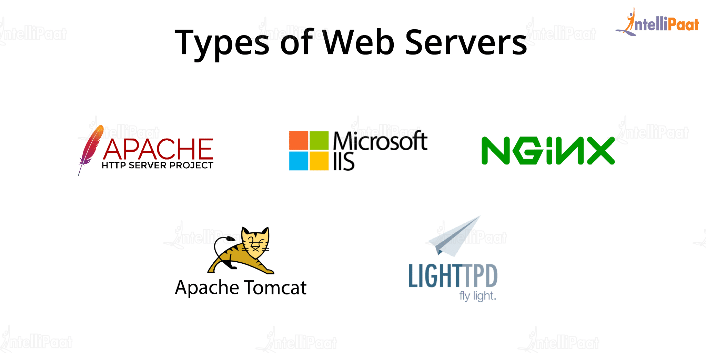
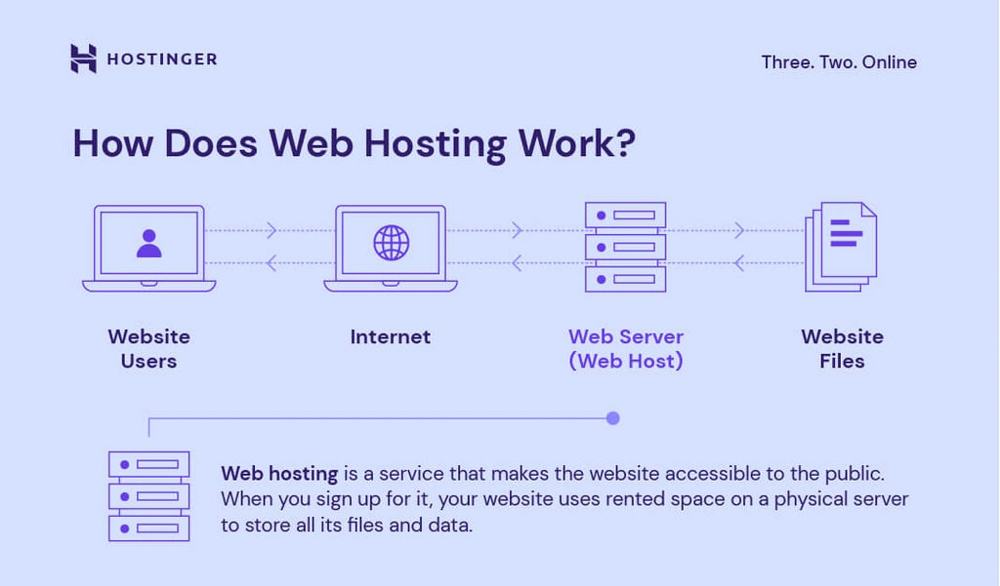
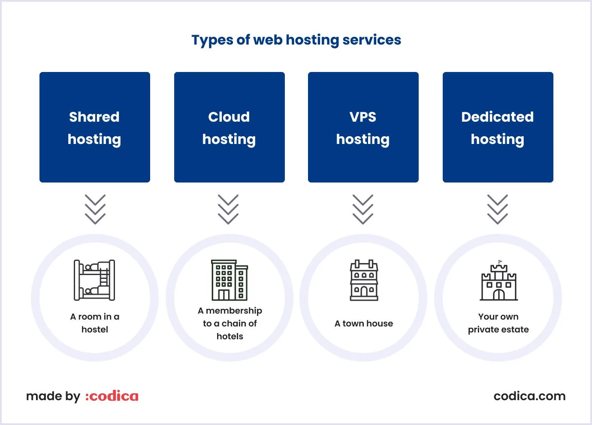

# Web Fundamentals
```
1. What is a protocol stack, and how is it used in web development?
```

- A Protocol is a set of rules and instruction to follow for communicating the data in Internet. 
- Rules are defined for each process during communication **between two or more devices.**
- Network layer have to follow these rules, inorder to transmit data successfully.

There are many protocols which operates in Internet layer which helps us to transmit data when a end-user request a website/ip address from a device.  
Request travels through all the network layer, finds the data then it returns back to origin (end-user).  

```
2. What are the different types of web servers, and how do they differ in terms of functionality and performance?
```



## Types of Web Server:  
- ### Apache HTTP Server
  - Open source application (we can access and make changes to its code)
  - It supports all OS like Linux, MacOS, Windows, etc.
- ### Nginx Web Server
  - Features of Nginx are high performance, stability, simple configuration and low resource.
  -  Not a open source application (we can't make changes to suit our needs)
  -  No threads are used to handle the requests by Nginx, instead a highly scalable event-driven architecture that uses small and predictable amount of memory under load is utilized.
- ### Internet Information Services
  - High performace Web server from Microsoft
  - Has all features of Apache HTTP server except not Open source, we can't make changes to suit our needs.
  - runs in Windows NT/2000 and 2003 platform.
- ### Lighttpd
  - Open source application (we can access and make changes to its code)
  - Has small CPU load and is therefore comparatively easier to run.
  - It requires less memory space to run which is always an advantage
- ### Sun Java System
  - Most suited for medium and large websites.
  - Not a open source application (we can't make changes to suit our needs)
  - It supports various languages, scripts, and technologies required for Web 2.0 such as Python, PHP, etc.
- ### Jigsaw Server
  - It was written in Java and it can run CGI (common gateway interference) scripts as well as PHP programs.
  - Open source application (we can access and make changes to its code)  
  - It supports various OS like Linux, MacOS, Windows, etc.  


```
3. What is web hosting, and what are the different types of hosting services available for websites?
```

Web hosting is a service that makes the website accessible to the public. When we register for it, our website uses a rented space on physical server to store all its files and data (all these can be managed from cloud itself)



### Different types of Hosting servers:

- Shared Hosting
- Cloud Hosting
- Dedicated Hosting
- Virtual Private Server (VPS) Hosting
- Managed (WordPress) Hosting
- Reseller Hosting



```    
4. What is scaling, and why is it important for web applications? How does scaling differ for vertical and horizontal scaling?
```

Ability to increase/decrease server when requirements is necessary while hosting a website. It is important to ensure that our website will always be up and running even when we are getting a huge traffic. Scaling horizontally and scaling vertically are similar in that they both involve adding computing resources to our infrastructure.

**Horizontal scaling** means scaling by adding more machines to your pool of resources (also described as “scaling out”), whereas **vertical scaling** refers to scaling by adding more power (e.g. CPU, RAM) to an existing machine (also described as “scaling up”).


```    
5. What is SEO (Search Engine Optimization), and how can web developers optimize their websites for better search engine rankings?
```
**Search Engine Optimization** plays a major role in browser search, when a user tries to find a specific product or company, etc. Browser should be able to provide the accurate result for the user. 

SEO looks for **keywords, analyzing website, prescribed Domain, content, loading speed, social media, mobile friendly, backlinks, site architecture, etc.** If we mainly focus on this, we would be able to achieve our search engine rankings goals in no time.

Also, there are other stats programs such as Google Analytics, Weblyzer, etc which can be used to track our web application.

