[Repo Link](https://github.com/Kamaruddheen/Kamaruddheen)

## Creating and Switching to the new branch

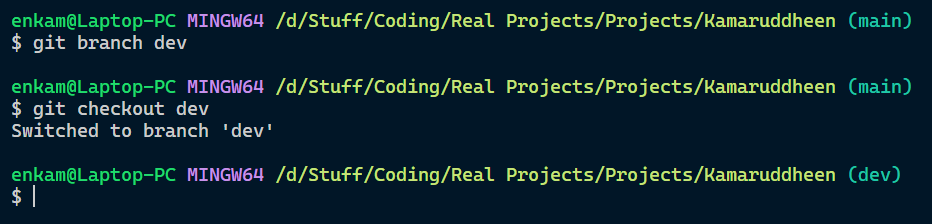

## Commit Changes to the Dev Branch

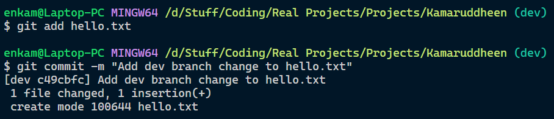

## Push Changes to the Dev Branch Push the changes to the dev branch using the following command:

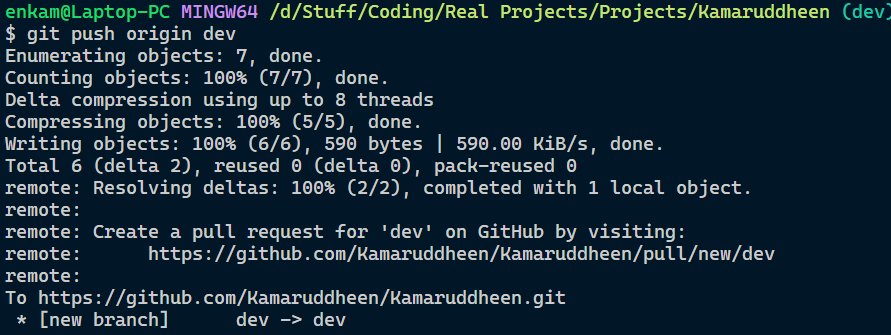

## Resolve Conflicts Switch back to the main branch

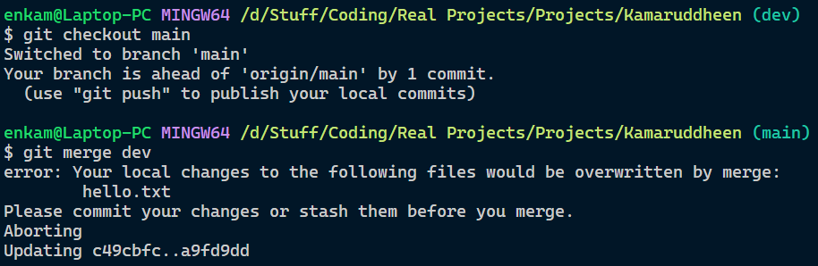

## Push Changes to the Main Branch Push

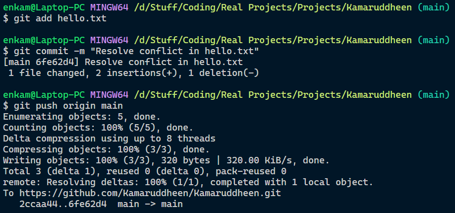

## Work with Remote Repositories

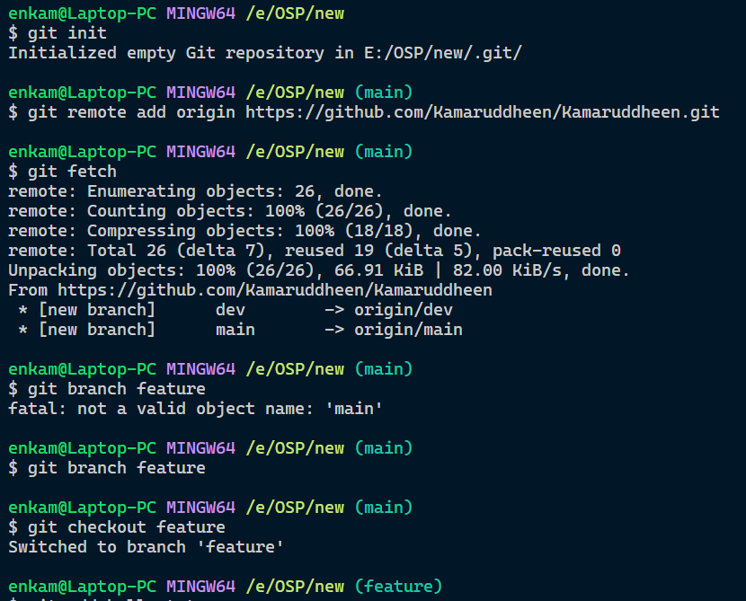

## Commit and Push Changes to the Feature Branch Add

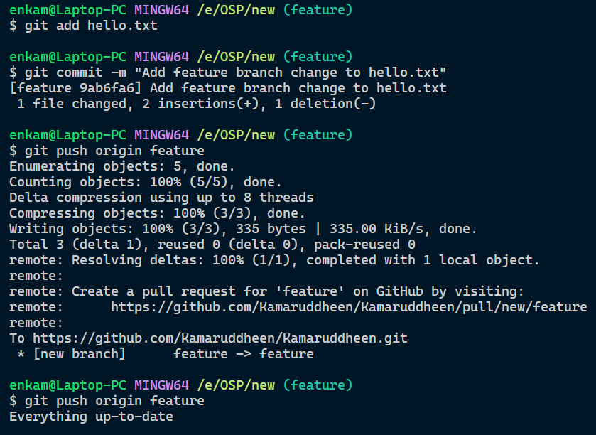

## Create and Merge PR

[PR 1 - Add feature branch](https://github.com/Kamaruddheen/Kamaruddheen/pull/1)

## Git Command Line Tools

#### Git status

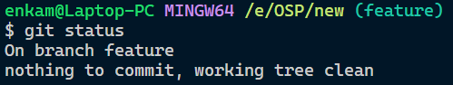

#### Creating a new branch

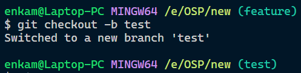

#### Deleting a existing branch

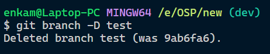

#### Revert a previous commit

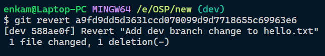